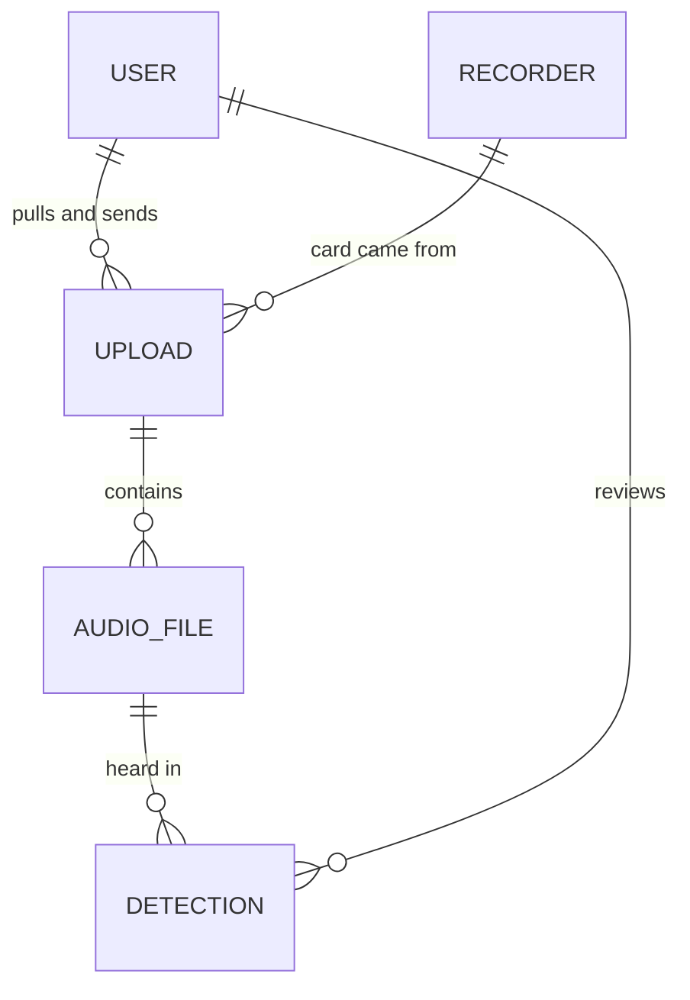

# Birdsense — data schema

What Birdsense stores and how. In production the documents live in Azure
Cosmos DB for NoSQL; in local development the same documents live in one JSON
file. The Go structs in `backend/internal/db/models.go` are the source of truth,
and this file describes them. Change the two together.

These are **stored** shapes, not API shapes. The handlers in `internal/api`
map between them (see [API mapping](#api-mapping)). The Azure resources behind
this schema are in [DEPLOYMENT.md](DEPLOYMENT.md).

## Overview

One database, `birdsense`, with one container per entity:

| Container    | Holds                                   | Partition key | `id`                                   |
|--------------|-----------------------------------------|---------------|----------------------------------------|
| `users`      | the roster: volunteers and admins       | `/id`         | random, `usr_<16 hex>`                 |
| `recorders`  | listening stations (device + location)  | `/id`         | printed on the unit, e.g. `SW-02`      |
| `uploads`    | one SD card's trip into storage         | `/id`         | the card reference, `OWL-YYYYMMDD-SRnn` |
| `audioFiles` | one recording from a card               | `/uploadId`   | `af_` + hash of upload id and path     |
| `detections` | one BirdNET result in one recording     | `/uploadId`   | `det_` + hash of file, start, species  |



Audio files and detections are partitioned by upload. Their volume grows with
every card, and the questions asked of them ("what's on this card", "what needs
review on this card") are per card. The other three containers are small, so
partitioning them by `id` keeps point reads cheap and costs nothing.

## Conventions

- **Every document** has `id`, `createdAt` and `updatedAt`. The store sets the
  two timestamps: creates set both, and updates and upserts set `updatedAt`.
- **Instants** are RFC 3339 strings in UTC, e.g. `"2026-09-13T10:12:00Z"`.
  Cosmos compares them as strings, which orders correctly only to whole seconds.
- **Calendar dates** are `YYYY-MM-DD` strings: `pulledOn`, and a `night` (the
  *evening* a night began, so a 3 a.m. file belongs to the day before). Sent as
  a timestamp, a date lands on the previous day for every reader west of UTC.
- **Optional fields** (marked `?` below) are left out of the document when
  empty, not stored as `null` or `""`.
- **Cosmos system properties** (`_rid`, `_etag`, `_ts`, ...) are added by
  Cosmos, ignored on read and never written by the app.
- **Ids are immutable**, and so is `uploadId` on the two child containers. An
  update cannot change them.
- **Nothing is hard-deleted** today. People leave the roster via `removedAt`;
  recorders leave the field via `retiredAt`.

## `users`

Someone on the roster. There is no password: the roster is the allow-list, and
sign-in is delegated to Google or Microsoft. The first admin is added at startup
from `BIRDSENSE_BOOTSTRAP_ADMIN`, but only when the roster is empty (see
DEPLOYMENT.md). Admins add everyone after that.

| Field          | Type      | Notes |
|----------------|-----------|-------|
| `id`           | string    | `usr_` + 16 random hex characters. |
| `email`        | string    | Trimmed and lower-cased. Unique across users (checked by the app, not by a Cosmos unique key; see [Uniqueness](#uniqueness)). |
| `name`         | string    | Display name. May be empty until the person signs in. |
| `role`         | string    | `volunteer` or `admin`. |
| `identity?`    | object    | `{provider, subject}`. Bound at first sign-in, so later sign-ins match on the provider's stable `sub` claim, not only the address. `provider` is `google` or `microsoft`. |
| `lastSignInAt?`| instant   | |
| `removedAt?`   | instant   | Set when taken off the roster. The document stays so uploads and reviews still resolve. |
| `createdAt`    | instant   | When added to the roster. |
| `updatedAt`    | instant   | |

```json
{
  "id": "usr_3f9a0c2b7d1e4a65",
  "email": "jane@example.com",
  "name": "Jane Volunteer",
  "role": "volunteer",
  "identity": { "provider": "google", "subject": "110248495921238986420" },
  "lastSignInAt": "2026-09-12T03:10:44Z",
  "createdAt": "2026-04-14T17:02:00Z",
  "updatedAt": "2026-09-12T03:10:44Z"
}
```

## `recorders`

One listening station. The device and the place it's mounted are a single
entity, and the id printed on the unit identifies both. Moving a unit
means editing its coordinates. Past cards keep their own copy of where
they were recorded (see [Denormalized copies](#denormalized-copies)).

| Field        | Type    | Notes |
|--------------|---------|-------|
| `id`         | string  | Typed by the coordinator from the unit's label, e.g. `SW-02`. A duplicate is a conflict. |
| `name`       | string  | Site name shown everywhere, e.g. `Marymoor Park – Snag Row`. |
| `latitude`   | number  | WGS 84 degrees, 5 decimal places from the map picker. |
| `longitude`  | number  | |
| `model?`     | string  | e.g. `SwiftOne`. |
| `notes?`     | string  | Mounting details, access instructions. |
| `retiredAt?` | instant | Set when the station is taken out of the field. |
| `createdAt`  | instant | When added. |
| `updatedAt`  | instant | |

```json
{
  "id": "SW-02",
  "name": "Marymoor Park – Snag Row",
  "latitude": 47.66021,
  "longitude": -122.11384,
  "model": "SwiftOne",
  "createdAt": "2026-03-14T18:00:00Z",
  "updatedAt": "2026-03-14T18:00:00Z"
}
```

## `uploads`

An upload session: one SD card, from the moment a volunteer registers it until
its results are sent. The id is the reference a volunteer quotes in email,
built from the pull date and the recorder: `OWL-20260907-SR02` is
recorder `SW-02`, pulled 7 September 2026.

| Field            | Type     | Notes |
|------------------|----------|-------|
| `id`             | string   | The card reference. |
| `recorderId`     | string   | → `recorders.id` |
| `recorder`       | object   | `{name, latitude, longitude}`: a copy of the recorder at registration time. |
| `userId`         | string   | → `users.id`, the volunteer who sent the card. Owns the card: other volunteers can't see it. |
| `userName`       | string   | Copy of the volunteer's name at registration time. |
| `pulledOn`       | date     | The day the card came out of the recorder. |
| `notes?`         | string   | Free text from the volunteer ("Batteries at 20% when swapped"). |
| `nights`         | array    | Per-night manifest the browser read off the card; see below. |
| `fileCount`      | integer  | Sum of `nights[].files`. |
| `totalBytes`     | integer  | Sum of `nights[].bytes`. |
| `filesUploaded`  | integer  | Only ever increases. |
| `bytesUploaded`  | integer  | Only ever increases. |
| `status`         | string   | See [Upload status](#upload-status). |
| `statusDetail?`  | string   | Short human reason shown instead of the status label, e.g. `2 unreadable`. |
| `analysis?`      | object   | How BirdNET was run over the card; see below. |
| `startedAt`      | instant  | When the transfer (re)started. |
| `receivedAt?`    | instant  | When the last file landed. |
| `processedAt?`   | instant  | When BirdNET finished. |
| `resultsSentAt?` | instant  | When the results email went out. |
| `createdAt`      | instant  | When the card was first registered. |
| `updatedAt`      | instant  | |

**`nights[]`**, one dusk-to-dawn block of recording:

| Field   | Type    | Notes |
|---------|---------|-------|
| `date`  | date    | The evening the night began. |
| `files` | integer | |
| `bytes` | integer | |
| `flag?` | string  | `short` (well under a typical night) or `partial` (a short last night). Absent when normal. |

**`analysis`**:

| Field           | Type    | Notes |
|-----------------|---------|-------|
| `model`         | string  | BirdNET model, e.g. `BirdNET_GLOBAL_6K_V2.4`. |
| `minConfidence` | number  | Detections below this weren't stored. |
| `sensitivity`   | number  | |
| `overlapSec`    | number  | |
| `startedAt`     | instant | |
| `finishedAt?`   | instant | |

```json
{
  "id": "OWL-20260907-SR02",
  "recorderId": "SW-02",
  "recorder": { "name": "Marymoor Park – Snag Row", "latitude": 47.66021, "longitude": -122.11384 },
  "userId": "usr_3f9a0c2b7d1e4a65",
  "userName": "Jane Volunteer",
  "pulledOn": "2026-09-07",
  "notes": "Batteries at 20% when swapped.",
  "nights": [
    { "date": "2026-08-24", "files": 24, "bytes": 9192000000 },
    { "date": "2026-08-30", "files": 11, "bytes": 4213000000, "flag": "short" }
  ],
  "fileCount": 35,
  "totalBytes": 13405000000,
  "filesUploaded": 20,
  "bytesUploaded": 7660000000,
  "status": "interrupted",
  "startedAt": "2026-09-13T03:14:00Z",
  "createdAt": "2026-09-13T03:14:00Z",
  "updatedAt": "2026-09-13T03:52:10Z"
}
```

### Upload status

```
in_progress ⇄ interrupted ──(last file lands)──▶ processing ──▶ results_sent
        any state ──(coordinator flags it)──▶ needs_attention ──(resolved)──▶ back
```

| Value             | Meaning | Set by |
|-------------------|---------|--------|
| `in_progress`     | Files are being sent. | Registration, or the client resuming. |
| `interrupted`     | The transfer stopped part way; resumable. | The client. |
| `processing`      | Every file received; BirdNET queued or running. | The server, never the client. |
| `needs_attention` | A coordinator has to look (short card, unreadable files). | Server checks or a coordinator. |
| `results_sent`    | Detections reviewed and results emailed. | The server. |

## `audioFiles`

One recording from a card. The id is derived from the card and the file's path
(`AudioFileID(uploadId, path)`), so registering the same card again after an
interruption produces the same ids instead of duplicates.

| Field            | Type    | Notes |
|------------------|---------|-------|
| `id`             | string  | `af_` + first 32 hex characters of SHA-256 over upload id and path. |
| `uploadId`       | string  | → `uploads.id`. **Partition key.** |
| `recorderId`     | string  | → `recorders.id`, copied from the upload for convenience. |
| `path`           | string  | Path on the card relative to its root, forward slashes, e.g. `DATA/20260824/20260825_040000.WAV`. |
| `sizeBytes`      | integer | |
| `night`          | date    | The evening the recording's night began. |
| `recordedAt?`    | instant | Recording start, when known (filename or file header). |
| `durationSec?`   | number  | Filled in by processing. |
| `sampleRate?`    | integer | Hz, filled in by processing. |
| `sha256?`        | string  | Hex checksum, to tell a corrupt transfer from a corrupt card. |
| `blobName`       | string  | Where the audio is stored; see [Blob naming](#blob-naming). |
| `status`         | string  | `pending` → `uploaded` → `analyzed`, or `failed`. |
| `statusDetail?`  | string  | Why it failed, e.g. `checksum mismatch`. |
| `uploadedAt?`    | instant | |
| `analyzedAt?`    | instant | |
| `detectionCount` | integer | Detections stored for this file (above threshold). |
| `createdAt`      | instant | |
| `updatedAt`      | instant | |

```json
{
  "id": "af_5b1e0f9d2c7a4e38b6d1f0a9c3e2b7d4",
  "uploadId": "OWL-20260907-SR02",
  "recorderId": "SW-02",
  "path": "DATA/20260824/20260825_040000.WAV",
  "sizeBytes": 383000000,
  "night": "2026-08-24",
  "recordedAt": "2026-08-25T11:00:00Z",
  "durationSec": 3600,
  "sampleRate": 48000,
  "blobName": "uploads/OWL-20260907-SR02/DATA/20260824/20260825_040000.WAV",
  "status": "analyzed",
  "uploadedAt": "2026-09-13T03:20:02Z",
  "analyzedAt": "2026-09-13T09:41:17Z",
  "detectionCount": 3,
  "createdAt": "2026-09-13T03:14:00Z",
  "updatedAt": "2026-09-13T09:41:17Z"
}
```

| Status     | Meaning |
|------------|---------|
| `pending`  | Registered from the card manifest; not in storage yet. |
| `uploaded` | In blob storage; not analyzed yet. |
| `analyzed` | BirdNET has run over it (it may still have zero detections). |
| `failed`   | Unreadable, checksum mismatch, or analysis error; see `statusDetail`. |

## `detections`

One BirdNET result above the analysis threshold: a species heard in one window
of one recording, plus a volunteer's review of it. The id is derived from the
file, the window start (in milliseconds) and the species, so re-ingesting the
same BirdNET output overwrites rather than duplicates.

| Field            | Type    | Notes |
|------------------|---------|-------|
| `id`             | string  | `det_` + first 32 hex characters of SHA-256 over audio file id, start ms and scientific name. |
| `uploadId`       | string  | → `uploads.id`. **Partition key.** |
| `audioFileId`    | string  | → `audioFiles.id` |
| `recorderId`     | string  | → `recorders.id` |
| `detectedAt`     | instant | Recording start + `startSec`. |
| `night`          | date    | The evening the night began. |
| `startSec`       | number  | Window start, seconds into the file. |
| `endSec`         | number  | Window end. |
| `scientificName` | string  | As BirdNET labelled it, e.g. `Strix varia`. |
| `commonName`     | string  | e.g. `Barred Owl`. |
| `confidence`     | number  | 0–1. |
| `reviewStatus`   | string  | `unreviewed`, `confirmed` or `rejected`. Top-level so it can be filtered on. |
| `review?`        | object  | The review; see below. Absent while unreviewed. |
| `createdAt`      | instant | |
| `updatedAt`      | instant | |

**`review`**, one review per detection. A later review replaces an earlier one:

| Field                      | Type    | Notes |
|----------------------------|---------|-------|
| `userId`                   | string  | → `users.id` |
| `userName`                 | string  | Copy at review time. |
| `at`                       | instant | |
| `correctedScientificName?` | string  | Set on a confirmed detection whose species BirdNET got wrong. |
| `correctedCommonName?`     | string  | |
| `note?`                    | string  | |

The **species a detection counts as** is the correction if there is one,
otherwise BirdNET's label (`Detection.Species()`). **Only `confirmed`
detections are ever shown publicly.** Rejected detections are kept, because
they are what a threshold or model change gets measured against.

```json
{
  "id": "det_9c41d7e2a0b35f86c1e4a7d20b9f3e65",
  "uploadId": "OWL-20260907-SR02",
  "audioFileId": "af_5b1e0f9d2c7a4e38b6d1f0a9c3e2b7d4",
  "recorderId": "SW-02",
  "detectedAt": "2026-08-25T11:12:12Z",
  "night": "2026-08-24",
  "startSec": 732,
  "endSec": 735,
  "scientificName": "Strix varia",
  "commonName": "Barred Owl",
  "confidence": 0.91,
  "reviewStatus": "confirmed",
  "review": { "userId": "usr_8d02e6f1a4c97b35", "userName": "Ellen Park", "at": "2026-09-14T02:05:31Z" },
  "createdAt": "2026-09-13T09:41:17Z",
  "updatedAt": "2026-09-14T02:05:31Z"
}
```

## Denormalized copies

Some documents carry copies of fields from another document, so that a list
can render without extra reads, and so the copy stays true to its moment:

| Copy                   | From          | Taken when            | Why it is not kept in sync |
|------------------------|---------------|-----------------------|----------------------------|
| `uploads.recorder`     | `recorders`   | card registered       | Moving or renaming a unit must not change where old cards were heard. |
| `uploads.userName`     | `users.name`  | card registered       | List rendering; the name at the time is fine. |
| `*.recorderId` on child docs | `uploads.recorderId` | file/detection written | Filtering without joining; never changes. |
| `review.userName`      | `users.name`  | review saved          | Same as `userName`. |

## Queries

Every read the API needs, and what it costs in Cosmos:

| Need | Store method | Container | Partition |
|------|--------------|-----------|-----------|
| Session: look up the signed-in person | `GetUserByEmail` | `users` | cross-partition |
| Roster | `ListUsers` | `users` | cross-partition (small) |
| Recorder list / map | `ListRecorders` | `recorders` | cross-partition (small) |
| One card | `GetUpload` | `uploads` | point read |
| A volunteer's cards | `ListUploads{UserID}` | `uploads` | cross-partition |
| Coordinator's card table | `ListUploads{Status?}` | `uploads` | cross-partition |
| Files on a card (resume, processing) | `ListAudioFiles` | `audioFiles` | single partition |
| Review queue for a card | `ListDetections{UploadID, ReviewStatus}` | `detections` | single partition |
| Public species summary | `ListDetections{ReviewStatus: confirmed, Since}` | `detections` | cross-partition |

**Query limits.** The Go SDK (`azcosmos`) runs cross-partition queries only when
the Cosmos gateway can serve them. So cross-partition queries are limited to
`SELECT * FROM c WHERE ...` with parameters. **No** `ORDER BY`, aggregates
(`COUNT`, `SUM`), `DISTINCT`, `TOP`, `OFFSET/LIMIT` or `GROUP BY`. Sorting,
counting and grouping happen in Go (`internal/db/db.go`), which also keeps the
two backends' answers identical. If the public summary gets expensive as
detections grow, replace it with a precomputed summary document, not a
cleverer query.

### Uniqueness

Cosmos unique keys apply within one logical partition, so they can't enforce a
unique `users.email` when users are partitioned by `id`. The store checks with a
query before creating or re-addressing a user. Two admins adding the same
address in the same instant could both succeed. On a small, admin-only roster
that race is accepted.

The same goes for "the roster always keeps an admin". The API counts admins
before a demotion or removal, but the count and the write touch different
documents, and Cosmos has no transaction across partitions. Two admins demoting
each other in the same instant could leave none. The fix for that would be
editing a document in Cosmos Data Explorer, as with a bootstrap typo.

Recorder, upload, audio-file and detection ids are unique by construction: the
id is the partition key, or derived deterministically within one.

### Concurrent updates

Updates are read → mutate → replace-if-unchanged. Cosmos uses an `If-Match`
ETag, retried up to five times on a 412; the local backend uses a mutex. That
is what makes rules like "upload counts only move forward" hold under
concurrent progress reports.

## Blob naming

Audio isn't stored in Cosmos. Each file goes to the storage account's `audio`
blob container (see DEPLOYMENT.md) under:

```
uploads/{uploadId}/{path on card}
```

e.g. `uploads/OWL-20260907-SR02/DATA/20260824/20260825_040000.WAV`
(`db.AudioBlobName`). The whole card is one prefix, so lifecycle rules and
clean-up can act on one card at a time.

## API mapping

The API's JSON shapes (what the frontend is built against) came first, so a few
names differ from storage. The handlers map between the two in
`internal/api/shapes.go` (field by field) and `internal/api/overview.go` (the
public summary), following these rules:

| API field | Stored as |
|-----------|-----------|
| `station.id`, `upload.stationId` | `recorders.id`, `uploads.recorderId` |
| `station.addedOn` (date) | `recorders.createdAt`, formatted as a date in America/Los_Angeles |
| `person.addedOn` (date) | `users.createdAt`, same |
| `person.provider` | `users.identity.provider`, title-cased; `—` before first sign-in |
| `upload.reference` | `uploads.id`, built by `db.UploadID(pulledOn, recorderId)` |
| `upload.stationName` | `uploads.recorder.name` (the copy, not the live recorder) |
| `upload.volunteerName` | `uploads.userName` |
| volunteer's own cards | filter on `uploads.userId`, not on name |
| `species[]` on the public overview | `detections` where `reviewStatus = confirmed` and `detectedAt` in the window, grouped in Go by `Species()`; `nights` = distinct `night`; `stations` = distinct `uploads.recorder.name` of their cards, most detections first |
| `program.recorders` | recorders with no `retiredAt` |
| `program.nightsRecorded` | distinct (`recorderId`, `nights[].date`) across all uploads, dated this calendar year (Pacific) |
| `program.confirmedDetections` | `detections` where `reviewStatus = confirmed`, heard this calendar year (Pacific) |

What the write routes do to documents:

| Route | Effect |
|-------|--------|
| `GET /stations`, `GET /admin/people`, `GET /dev/people` | Leave out retired recorders and removed users. |
| `POST /session` | Sets `lastSignInAt`. A removed user can't sign in, and their open session stops working. |
| `POST /uploads` | Creates the upload. If that id exists and is the caller's, it is a resume: `notes`, `nights` and the totals are replaced, the uploaded counts and the `recorder`/`userName` copies are kept, and `status` goes back to `in_progress` only if the card was still transferring. Someone else's card is a 409. |
| `POST /uploads/{ref}/progress` | Counts only increase, capped at the totals. The client's `status` applies only while the card is `in_progress` or `interrupted`; the last file sets `processing` and `receivedAt`. |
| `DELETE /admin/people/{id}` | Sets `removedAt`. |
| `POST /admin/people` | An address held by a removed user reinstates that document (clears `removedAt`, takes the new name and role) instead of conflicting. |
| `DELETE /admin/stations/{id}` | Sets `retiredAt`. |
| `POST /admin/stations` | A retired recorder's id (compared case-insensitively) reinstates it at the new name and position. |

## Local JSON file

With `BIRDSENSE_DB=local`, the whole dataset is one file (default
`backend/data/birdsense.json`, git-ignored) holding the same documents, keyed
by id:

```json
{
  "version": 1,
  "users":      { "usr_3f9a0c2b7d1e4a65": { "id": "usr_3f9a0c2b7d1e4a65", "...": "..." } },
  "recorders":  { "SW-02": { "...": "..." } },
  "uploads":    { "OWL-20260907-SR02": { "...": "..." } },
  "audioFiles": { "af_5b1e...": { "...": "..." } },
  "detections": { "det_9c41...": { "...": "..." } }
}
```

The file is read once at startup, held in memory and rewritten in full,
atomically, after every change. It's fine to hand-edit it while the server
is stopped. Delete it to start over. On startup, a database with no users,
recorders or uploads is filled by `internal/devseed` with a placeholder program
(six people, five recorders, nine cards, a few weeks of reviewed detections),
dated relative to that day. Setting `BIRDSENSE_BOOTSTRAP_ADMIN` in dev skips
that, because the roster is no longer empty. A file with a different `version` is
refused rather than guessed at. It is sized for development: a season of real
detections would make every write slow.
