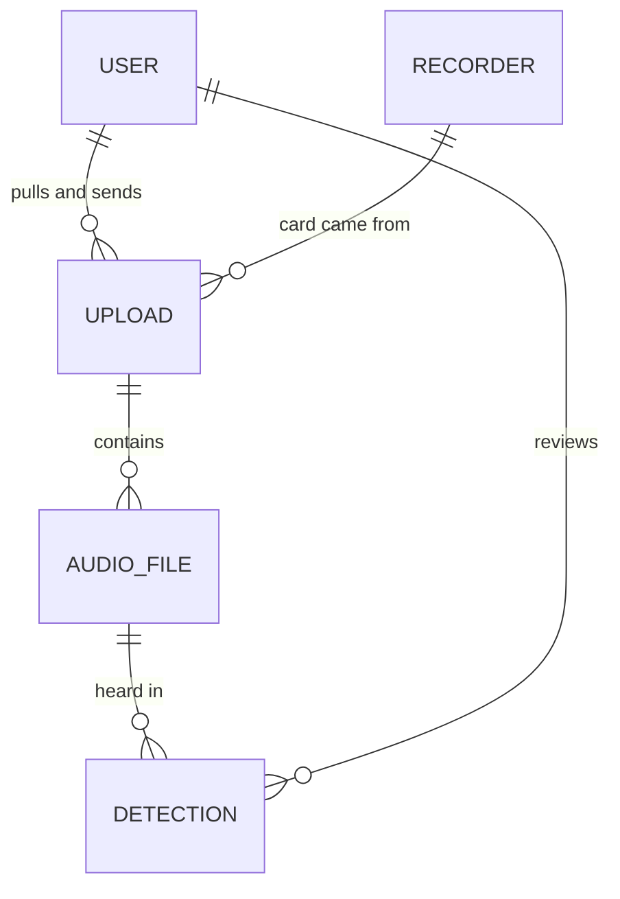

# Birdsense — data schema

What Birdsense stores and how. In production the documents live in Azure
Cosmos DB for NoSQL; in local development the same documents live in one JSON
file. The Go structs in `backend/internal/db/models.go` are the source of truth,
and this file describes them. Change the two together.

These are **stored** shapes, not API shapes. The handlers in `internal/api`
map between them (see [API mapping](#api-mapping)). The Azure resources behind
this schema are in [DEPLOYMENT.md](DEPLOYMENT.md).

## Overview

One database, `birdsense`, with one container per entity:

| Container    | Holds                                   | Partition key | `id`                                   |
|--------------|-----------------------------------------|---------------|----------------------------------------|
| `users`      | the roster: volunteers and admins       | `/id`         | random, `usr_<16 hex>`                 |
| `recorders`  | listening stations (device + location)  | `/id`         | printed on the unit, e.g. `SW-02`      |
| `uploads`    | one SD card's trip into storage         | `/id`         | the card reference, `OWL-YYYYMMDD-SRnn` |
| `audioFiles` | one recording from a card               | `/uploadId`   | `af_` + hash of upload id and path     |
| `detections` | one species heard in one recording      | `/uploadId`   | `det_` + hash of file, start, species  |



Audio files and detections are partitioned by upload. Their volume grows with
every card, and the questions asked of them ("what's on this card", "what needs
review on this card") are per card. The other three containers are small, so
partitioning them by `id` keeps point reads cheap and costs nothing.

## Conventions

- **Every document** has `id`, `createdAt` and `updatedAt`. The store sets the
  two timestamps: creates set both, and updates and upserts set `updatedAt`.
- **Instants** are RFC 3339 strings in UTC, e.g. `"2026-09-13T10:12:00Z"`.
  Cosmos compares them as strings, which orders correctly only to whole seconds.
- **Calendar dates** are `YYYY-MM-DD` strings: `pulledOn`, and a `night` (the
  *evening* a night began, so a 3 a.m. file belongs to the day before). Sent as
  a timestamp, a date lands on the previous day for every reader west of UTC.
- **Optional fields** (marked `?` below) are left out of the document when
  empty, not stored as `null` or `""`.
- **Cosmos system properties** (`_rid`, `_etag`, `_ts`, ...) are added by
  Cosmos, ignored on read and never written by the app.
- **Ids are immutable**, and so is `uploadId` on the two child containers. An
  update cannot change them.
- **Only cards are hard-deleted**, by a coordinator, and a card takes its
  `audioFiles`, `detections`, stored audio and clips with it. People leave the roster
  via `removedAt` and recorders leave the field via `retiredAt`, because cards
  point at both.

## `users`

Someone on the roster. There is no password: the roster is the allow-list, and
sign-in is delegated to Google or Microsoft. The first admin is added at startup
from `BIRDSENSE_BOOTSTRAP_ADMIN`, but only when the roster is empty (see
DEPLOYMENT.md). Admins add everyone after that.

| Field          | Type      | Notes |
|----------------|-----------|-------|
| `id`           | string    | `usr_` + 16 random hex characters. |
| `email`        | string    | Trimmed and lower-cased. Unique across users (checked by the app, not by a Cosmos unique key; see [Uniqueness](#uniqueness)). |
| `name`         | string    | Display name. May be empty until the person signs in. |
| `role`         | string    | `volunteer` or `admin`. |
| `identity?`    | object    | `{provider, subject}`. Bound at first sign-in, so later sign-ins match on the provider's stable `sub` claim, not only the address. `provider` is `google` or `microsoft`. |
| `lastSignInAt?`| instant   | |
| `removedAt?`   | instant   | Set when taken off the roster. The document stays so uploads and reviews still resolve. |
| `createdAt`    | instant   | When added to the roster. |
| `updatedAt`    | instant   | |

```json
{
  "id": "usr_3f9a0c2b7d1e4a65",
  "email": "jane@example.com",
  "name": "Jane Volunteer",
  "role": "volunteer",
  "identity": { "provider": "google", "subject": "110248495921238986420" },
  "lastSignInAt": "2026-09-12T03:10:44Z",
  "createdAt": "2026-04-14T17:02:00Z",
  "updatedAt": "2026-09-12T03:10:44Z"
}
```

## `recorders`

One listening station. The device and the place it's mounted are a single
entity, and the id printed on the unit identifies both. Moving a unit
means editing its coordinates. Past cards keep their own copy of where
they were recorded (see [Denormalized copies](#denormalized-copies)).

| Field        | Type    | Notes |
|--------------|---------|-------|
| `id`         | string  | Typed by the coordinator from the unit's label, e.g. `SW-02`. A duplicate is a conflict. |
| `name`       | string  | Site name shown everywhere, e.g. `Marymoor Park – Snag Row`. |
| `latitude`   | number  | WGS 84 degrees, 5 decimal places from the map picker. |
| `longitude`  | number  | |
| `model?`     | string  | e.g. `SwiftOne`. |
| `notes?`     | string  | Mounting details, access instructions. |
| `retiredAt?` | instant | Set when the station is taken out of the field. |
| `createdAt`  | instant | When added. |
| `updatedAt`  | instant | |

```json
{
  "id": "SW-02",
  "name": "Marymoor Park – Snag Row",
  "latitude": 47.66021,
  "longitude": -122.11384,
  "model": "SwiftOne",
  "createdAt": "2026-03-14T18:00:00Z",
  "updatedAt": "2026-03-14T18:00:00Z"
}
```

## `uploads`

An upload session: one SD card, from the moment a volunteer registers it until
its results are sent. The id is the reference a volunteer quotes in email,
built from the pull date and the recorder: `OWL-20260907-SR02` is
recorder `SW-02`, pulled 7 September 2026.

| Field            | Type     | Notes |
|------------------|----------|-------|
| `id`             | string   | The card reference. |
| `recorderId`     | string   | → `recorders.id` |
| `recorder`       | object   | `{name, latitude, longitude}`: a copy of the recorder at registration time. |
| `userId`         | string   | → `users.id`, the volunteer who sent the card. Owns the card: other volunteers can't see it. |
| `userName`       | string   | Copy of the volunteer's name at registration time. |
| `pulledOn`       | date     | The day the card came out of the recorder. |
| `notes?`         | string   | Free text from the volunteer ("Batteries at 20% when swapped"). |
| `nights`         | array    | Per-night manifest the browser read off the card; see below. |
| `fileCount`      | integer  | Sum of `nights[].files`. |
| `totalBytes`     | integer  | Sum of `nights[].bytes`. |
| `filesUploaded`  | integer  | The card's audio files in `uploaded`, `analyzing` or `analyzed` status, counted by the server as each file lands. Capped at `fileCount`. |
| `bytesUploaded`  | integer  | Their total size. Capped at `totalBytes`. |
| `filesAnalyzed`  | integer  | The card's listed audio files in `analyzed` status, recounted by the analysis queue after each file. |
| `filesFailed`    | integer  | The card's listed audio files in `failed` status, recounted the same way. |
| `detectionCount` | integer  | Sum of `detectionCount` over the analyzed files. |
| `status`         | string   | See [Upload status](#upload-status). |
| `statusDetail?`  | string   | Short human reason shown instead of the status label, e.g. `2 unreadable`. |
| `analysis?`      | object   | How BirdNET was run over the card; see below. |
| `startedAt`      | instant  | When the transfer (re)started. |
| `receivedAt?`    | instant  | When the last file landed. |
| `processedAt?`   | instant  | When BirdNET finished the card's last file. |
| `resultsSentAt?` | instant  | When the results email went out. |
| `createdAt`      | instant  | When the card was first registered. |
| `updatedAt`      | instant  | |

**`nights[]`**, one dusk-to-dawn block of recording:

| Field   | Type    | Notes |
|---------|---------|-------|
| `date`  | date    | The evening the night began. |
| `files` | integer | |
| `bytes` | integer | |
| `flag?` | string  | `short` (well under a typical night) or `partial` (a short last night). Absent when normal. |

**`analysis`**:

| Field           | Type    | Notes |
|-----------------|---------|-------|
| `model`         | string  | BirdNET model, e.g. `BirdNET_GLOBAL_6K_V2.4`. Empty until the first file is done, since the analyzer reports it. |
| `minConfidence` | number  | Detections below this weren't stored. |
| `sensitivity`   | number  | |
| `overlapSec`    | number  | |
| `startedAt`     | instant | When the queue started on the card's first file. |
| `finishedAt?`   | instant | Same as `processedAt`. |

Every file is analyzed with the recorder's position (the `recorder` copy) and
the BirdNET week of its night, so BirdNET's geo model narrows the species to
those expected there and then.

```json
{
  "id": "OWL-20260907-SR02",
  "recorderId": "SW-02",
  "recorder": { "name": "Marymoor Park – Snag Row", "latitude": 47.66021, "longitude": -122.11384 },
  "userId": "usr_3f9a0c2b7d1e4a65",
  "userName": "Jane Volunteer",
  "pulledOn": "2026-09-07",
  "notes": "Batteries at 20% when swapped.",
  "nights": [
    { "date": "2026-08-24", "files": 24, "bytes": 9192000000 },
    { "date": "2026-08-30", "files": 11, "bytes": 4213000000, "flag": "short" }
  ],
  "fileCount": 35,
  "totalBytes": 13405000000,
  "filesUploaded": 20,
  "bytesUploaded": 7660000000,
  "status": "interrupted",
  "startedAt": "2026-09-13T03:14:00Z",
  "createdAt": "2026-09-13T03:14:00Z",
  "updatedAt": "2026-09-13T03:52:10Z"
}
```

### Upload status

```
in_progress ⇄ interrupted ──(last file lands)──▶ processing ──(last file analyzed)──▶ in_review ──▶ results_sent
                                                     └──(some files failed)──▶ needs_attention
        any state ──(coordinator flags it)──▶ needs_attention ──(resolved)──▶ back
```

| Value             | Meaning | Set by |
|-------------------|---------|--------|
| `in_progress`     | Files are being sent. | Registration, or the client resuming. |
| `interrupted`     | The transfer stopped part way; resumable. | The client. |
| `processing`      | Every file received; BirdNET queued or running. | The server, never the client. |
| `in_review`       | BirdNET has analyzed every file; detections wait for review. | The analysis queue. |
| `needs_attention` | A coordinator has to look (short card, unreadable files). The analysis queue sets it, with `statusDetail` like `2 files not analyzed`, when it finishes a card some of whose files failed. | Server checks or a coordinator. |
| `results_sent`    | Detections reviewed and results emailed. | The server. |

## `audioFiles`

One recording from a card. The id is derived from the card and the file's path
(`AudioFileID(uploadId, path)`), so registering the same card again after an
interruption produces the same ids instead of duplicates.

| Field            | Type    | Notes |
|------------------|---------|-------|
| `id`             | string  | `af_` + first 32 hex characters of SHA-256 over upload id and path. |
| `uploadId`       | string  | → `uploads.id`. **Partition key.** |
| `recorderId`     | string  | → `recorders.id`, copied from the upload for convenience. |
| `path`           | string  | Path on the card relative to its root, forward slashes, e.g. `DATA/20260824/20260825_040000.WAV`. |
| `sizeBytes`      | integer | |
| `night`          | date    | The evening the recording's night began. |
| `recordedAt?`    | instant | Recording start, when known. The analysis queue fills it in from the file name (`20260723_160624`, local time, with an optional `(-0700)` offset; Pacific without one). |
| `durationSec?`   | number  | Filled in by the analysis queue, which reads it while cutting clips. |
| `sampleRate?`    | integer | Hz, filled in the same way. |
| `sha256?`        | string  | Hex checksum, to tell a corrupt transfer from a corrupt card. |
| `blobName?`      | string  | Where the audio is stored, set when its last byte lands; see [Blob naming](#blob-naming). |
| `status`         | string  | `pending` → `uploaded` → `analyzing` → `analyzed`, or `failed`. |
| `statusDetail?`  | string  | Why it failed, e.g. `checksum mismatch`. |
| `uploadedAt?`    | instant | |
| `analyzedAt?`    | instant | When BirdNET finished with it, or gave up on it. |
| `detectionCount` | integer | Detections stored for this file (above threshold). |
| `createdAt`      | instant | |
| `updatedAt`      | instant | |

```json
{
  "id": "af_5b1e0f9d2c7a4e38b6d1f0a9c3e2b7d4",
  "uploadId": "OWL-20260907-SR02",
  "recorderId": "SW-02",
  "path": "DATA/20260824/20260825_040000.WAV",
  "sizeBytes": 383000000,
  "night": "2026-08-24",
  "recordedAt": "2026-08-25T11:00:00Z",
  "durationSec": 3600,
  "sampleRate": 48000,
  "blobName": "uploads/OWL-20260907-SR02/K7XQ3M2NHD5WBYVAJF4TGC6PLE",
  "status": "analyzed",
  "uploadedAt": "2026-09-13T03:20:02Z",
  "analyzedAt": "2026-09-13T09:41:17Z",
  "detectionCount": 3,
  "createdAt": "2026-09-13T03:14:00Z",
  "updatedAt": "2026-09-13T09:41:17Z"
}
```

| Status     | Meaning |
|------------|---------|
| `pending`  | Registered from the card manifest; not in storage yet. |
| `uploaded` | In file storage; not analyzed yet. On a `processing` card, this is the analysis queue: the file is waiting for BirdNET. |
| `analyzing`| BirdNET is running over it. Found at startup, it was cut off by a restart, and is run again. |
| `analyzed` | BirdNET has run over it (it may still have zero detections). |
| `failed`   | Unreadable, checksum mismatch, or analysis error; see `statusDetail`. BirdNET's own report for an unreadable file (`unreadable audio`), `the audio isn't in storage`, or, when the analyzer itself crashed on the file three times, that and the first line of its error. Also a file that was not on the list when its card was registered again (`statusDetail`: `not on the card when it was registered again`); the document stays, with `blobName` still pointing at anything stored for it. |

## `detections`

A species BirdNET heard above the analysis threshold in one recording, over a
run of consecutive 3-second windows, plus a volunteer's review of it. The
analysis queue merges the windows: a species heard in the windows at 0–3 s,
3–6 s and 6–9 s is one detection from 0 to 9 s, at the highest confidence of the
three, and a window without it ends the run. The id is derived from the file,
the run's start (in milliseconds) and the species, so analyzing a file again
overwrites rather than duplicates.

| Field            | Type    | Notes |
|------------------|---------|-------|
| `id`             | string  | `det_` + first 32 hex characters of SHA-256 over audio file id, start ms and scientific name. |
| `uploadId`       | string  | → `uploads.id`. **Partition key.** |
| `audioFileId`    | string  | → `audioFiles.id` |
| `recorderId`     | string  | → `recorders.id` |
| `detectedAt`     | instant | Recording start (`audioFiles.recordedAt`) + `startSec`. For a file whose name has no time, midnight Pacific at the start of its `night`. |
| `night`          | date    | The evening the night began. |
| `startSec`       | number  | Start of the run's first window, seconds into the file. |
| `endSec`         | number  | End of its last window. |
| `scientificName` | string  | As BirdNET labelled it, e.g. `Strix varia`. |
| `commonName`     | string  | e.g. `Barred Owl`. |
| `confidence`     | number  | 0–1, the highest of the run's windows. |
| `clip?`          | object  | The stretch of the recording stored for review; see below. Absent on detections stored before clips were cut. |
| `reviewStatus`   | string  | `unreviewed`, `confirmed` or `rejected`. Top-level so it can be filtered on. |
| `review?`        | object  | The review; see below. Absent while unreviewed. |
| `createdAt`      | instant | |
| `updatedAt`      | instant | |

**`review`**, one review per detection. A later review replaces an earlier one:

| Field                      | Type    | Notes |
|----------------------------|---------|-------|
| `userId`                   | string  | → `users.id` |
| `userName`                 | string  | Copy at review time. |
| `at`                       | instant | |
| `correctedScientificName?` | string  | Set on a confirmed detection whose species BirdNET got wrong. |
| `correctedCommonName?`     | string  | |
| `note?`                    | string  | |

**`clip`**, a few seconds of the recording stored as its own WAV (mono, 16-bit,
at the recording's sample rate), so a reviewer can hear the detection without
the whole file:

| Field      | Type   | Notes |
|------------|--------|-------|
| `blobName` | string | Where it is stored; see [Blob naming](#blob-naming). |
| `startSec` | number | Seconds into the audio file: the detection's start less 1 s, clamped to the file. |
| `endSec`   | number | The detection's end plus 1 s, clamped to the file. A run too long for a 30 s clip gets the 30 s centred on its most confident window instead. |

The **species a detection counts as** is the correction if there is one,
otherwise BirdNET's label (`Detection.Species()`). **Only `confirmed`
detections are ever shown publicly.** Rejected detections are kept, because
they are what a threshold or model change gets measured against.

```json
{
  "id": "det_9c41d7e2a0b35f86c1e4a7d20b9f3e65",
  "uploadId": "OWL-20260907-SR02",
  "audioFileId": "af_5b1e0f9d2c7a4e38b6d1f0a9c3e2b7d4",
  "recorderId": "SW-02",
  "detectedAt": "2026-08-25T11:12:12Z",
  "night": "2026-08-24",
  "startSec": 732,
  "endSec": 735,
  "scientificName": "Strix varia",
  "commonName": "Barred Owl",
  "confidence": 0.91,
  "clip": { "blobName": "clips/OWL-20260907-SR02/det_9c41d7e2a0b35f86c1e4a7d20b9f3e65.wav", "startSec": 731, "endSec": 736 },
  "reviewStatus": "confirmed",
  "review": { "userId": "usr_8d02e6f1a4c97b35", "userName": "Ellen Park", "at": "2026-09-14T02:05:31Z" },
  "createdAt": "2026-09-13T09:41:17Z",
  "updatedAt": "2026-09-14T02:05:31Z"
}
```

## Denormalized copies

Some documents carry copies of fields from another document, so that a list
can render without extra reads, and so the copy stays true to its moment:

| Copy                   | From          | Taken when            | Why it is not kept in sync |
|------------------------|---------------|-----------------------|----------------------------|
| `uploads.recorder`     | `recorders`   | card registered       | Moving or renaming a unit must not change where old cards were heard. |
| `uploads.userName`     | `users.name`  | card registered       | List rendering; the name at the time is fine. |
| `*.recorderId` on child docs | `uploads.recorderId` | file/detection written | Filtering without joining; never changes. |
| `review.userName`      | `users.name`  | review saved          | Same as `userName`. |

## Queries

Every read the API needs, and what it costs in Cosmos:

| Need | Store method | Container | Partition |
|------|--------------|-----------|-----------|
| Session: look up the signed-in person | `GetUserByEmail` | `users` | cross-partition |
| Roster | `ListUsers` | `users` | cross-partition (small) |
| Recorder list / map | `ListRecorders` | `recorders` | cross-partition (small) |
| One card | `GetUpload` | `uploads` | point read |
| A volunteer's cards | `ListUploads{UserID}` | `uploads` | cross-partition |
| Coordinator's card table | `ListUploads{Status?}` | `uploads` | cross-partition |
| Files on a card (registering, counting, the admin card page, analysis) | `ListAudioFiles` | `audioFiles` | single partition |
| Analysis queue: cards with files waiting | `ListUploads{Status: processing}` | `uploads` | cross-partition |
| A file about to be uploaded | `GetAudioFile` | `audioFiles` | point read |
| One detection (its page, its clip, a review) | `GetDetection` | `detections` | point read |
| Review queue for a card | `ListDetections{UploadID, ReviewStatus}` | `detections` | single partition |
| What was heard in one file (admin card page) | `ListDetections{UploadID, AudioFileID}` | `detections` | single partition |
| Public species summary | `ListDetections{ReviewStatus: confirmed, Since}` | `detections` | cross-partition |
| Every detection (admin Detections tab) | `ListDetections{ReviewStatus?, Since?, Until?, MinConfidence?}` | `detections` | cross-partition: reads every match, then sorts and pages in Go |
| Deleting a card | `DeleteUpload` | `audioFiles`, then `detections`, then `uploads` | single partition: a query for the ids, then a delete per document |

**Query limits.** The Go SDK (`azcosmos`) runs cross-partition queries only when
the Cosmos gateway can serve them. So cross-partition queries are limited to
`SELECT * FROM c WHERE ...` with parameters. **No** `ORDER BY`, aggregates
(`COUNT`, `SUM`), `DISTINCT`, `TOP`, `OFFSET/LIMIT` or `GROUP BY`. Sorting,
counting and grouping happen in Go (`internal/db/db.go`), which also keeps the
two backends' answers identical. If the public summary gets expensive as
detections grow, replace it with a precomputed summary document, not a
cleverer query.

### Uniqueness

Cosmos unique keys apply within one logical partition, so they can't enforce a
unique `users.email` when users are partitioned by `id`. The store checks with a
query before creating or re-addressing a user. Two admins adding the same
address in the same instant could both succeed. On a small, admin-only roster
that race is accepted.

The same goes for "the roster always keeps an admin". The API counts admins
before a demotion or removal, but the count and the write touch different
documents, and Cosmos has no transaction across partitions. Two admins demoting
each other in the same instant could leave none. The fix for that would be
editing a document in Cosmos Data Explorer, as with a bootstrap typo.

Recorder, upload, audio-file and detection ids are unique by construction: the
id is the partition key, or derived deterministically within one.

### Concurrent updates

Updates are read → mutate → replace-if-unchanged. Cosmos uses an `If-Match`
ETag, retried up to five times on a 412; the local backend uses a mutex. That
is what makes rules like "upload counts only move forward" hold under
concurrent progress reports.

## Blob naming

Audio isn't stored in Cosmos. Each file goes to the storage account's `audio`
blob container (see DEPLOYMENT.md), or in local development to the same name
under `BIRDSENSE_STORAGE_DIR`:

```
uploads/{uploadId}/{random}
```

e.g. `uploads/OWL-20260907-SR02/K7XQ3M2NHD5WBYVAJF4TGC6PLE`. That is
`storage.Name` of the file's tus upload id, which the server picks when the
upload is created. The name isn't the path on the card, because two tries at
the same file (one abandoned, one started over) mustn't write into the same
blob; the path is on the `audioFiles` document, and so is `blobName`. The whole
card is one prefix, so lifecycle rules and clean-up can act on one card at a
time. In the prefix, anything but letters, digits, `-`, `_` and `.` becomes `_`,
since an upload id has to be URL-safe.

Detection clips are cut by the server rather than uploaded, and go under their
own prefix:

```
clips/{uploadId}/{detectionId}.wav
```

A clip is named by its detection, so analyzing a file again replaces its clips
instead of adding more. They are outside `uploads/`, so a lifecycle rule that
tiers or deletes the originals leaves what reviewers listen to alone. The same
characters are replaced in both parts of the name.

Beside each file, tusd keeps `{name}.info`: a small JSON record of the upload,
with its size and the metadata the server set (`reference`, `path`,
`audioFileId`, `userId`). In Azure a file is a block blob whose block list is
committed when the last byte lands, so the blob only appears once it is whole;
until then the blocks are uncommitted, and Azure discards them after 7 days. A
local file grows in place. Nothing deletes `.info` records, or what's left of
uploads that never finished, until the card is deleted, which removes
everything under its prefix, and under its `clips/` prefix too.

## API mapping

The API's JSON shapes (what the frontend is built against) came first, so a few
names differ from storage. The handlers map between the two in
`internal/api/shapes.go` (field by field) and `internal/api/overview.go` (the
public summary), following these rules:

| API field | Stored as |
|-----------|-----------|
| `station.id`, `upload.stationId` | `recorders.id`, `uploads.recorderId` |
| `station.addedOn` (date) | `recorders.createdAt`, formatted as a date in America/Los_Angeles |
| `person.addedOn` (date) | `users.createdAt`, same |
| `person.provider` | `users.identity.provider`, title-cased; `—` before first sign-in |
| `upload.reference` | `uploads.id`, built by `db.UploadID(pulledOn, recorderId)` |
| `files[].bytes` (`POST /uploads`) | `audioFiles.sizeBytes`; `files[].path` is `path`, normalized by `db.CardPath` |
| `upload.stationName` | `uploads.recorder.name` (the copy, not the live recorder) |
| `upload.volunteerName` | `uploads.userName` |
| `detection.review` | `{by, at}`: `review.userName` and `review.at`; absent while unreviewed |
| `detection.clip` | `{startSec, endSec}` of `clip`; the blob name isn't sent |
| volunteer's own cards | filter on `uploads.userId`, not on name |
| `species[]` on the public overview | `detections` where `reviewStatus = confirmed` and `detectedAt` in the window, grouped in Go by `Species()`; `nights` = distinct `night`; `stations` = distinct `uploads.recorder.name` of their cards, most detections first |
| `program.recorders` | recorders with no `retiredAt` |
| `program.nightsRecorded` | distinct (`recorderId`, `nights[].date`) across all uploads, dated this calendar year (Pacific) |
| `program.confirmedDetections` | `detections` where `reviewStatus = confirmed`, heard this calendar year (Pacific) |

What the write routes do to documents:

| Route | Effect |
|-------|--------|
| `GET /stations`, `GET /admin/people`, `GET /dev/people` | Leave out retired recorders and removed users. |
| `POST /session` | Sets `lastSignInAt`. A removed user can't sign in, and their open session stops working. |
| `POST /uploads` | Creates the upload, and a `pending` audio file for each file listed. The list has to add up to `nights`. If that id exists and is the caller's, it is a resume: `notes` are replaced and the `recorder`/`userName` copies are kept. If the card is already received, the same list (paths and sizes) answers the card as it is, and a different list is a 409: it is another card with that recorder and pull date. If the card was still transferring, `nights` and the totals are replaced too, `status` goes back to `in_progress`, and the audio files are matched to the new list: a listed file already `uploaded` at the same size stays, other listed files are `pending`, and a file no longer listed becomes `failed`. The uploaded counts are then recounted. Someone else's card is a 409. Answers the card and its listed files. |
| `GET /uploads/{ref}` | Answers the card and its listed files with their `status`, the same list `POST /uploads` answers. The browser checks a card chosen again against it before registering it. |
| `POST /uploads/{ref}/progress` | Sets `status` to the client's `in_progress` or `interrupted`, only while the card is one of those. The client can't report counts. |
| `POST /tus/` | Creates a tus upload for one file. Refused unless the card is the caller's (or they are an admin) and still transferring, and the file is on its list, at that size, and not already `uploaded`. The server names the upload `{uploadId}/{random}` and replaces its metadata. Writes no document. |
| `PATCH /tus/{id}`, last byte | Sets the audio file's `status` to `uploaded` with `uploadedAt` and `blobName`, then recounts `filesUploaded` and `bytesUploaded` from the card's audio files. When none is still `pending`, sets `processing` and `receivedAt`, and wakes the analysis queue. |
| `GET /admin/uploads/{ref}` | Answers the card and its audio files, leaving out files that are no longer on its list. |
| `GET /admin/detections` | Answers a page of every card's detections (`?since=&until=` RFC 3339, `status`, `minConfidence` 0–1, `species`, `sort=heard\|species\|confidence`, `order`, `limit` ≤ 500, `offset`) as `{detections, total, species}`. The date, review and confidence filters go into the query; the species filter, sort and page are applied in Go. Species here are BirdNET's `scientificName`/`commonName`, not a review's correction. Each row adds `reference` (`uploadId`), `stationName` (`uploads.recorder.name`) and `night`. `species[]` counts every match before the species filter. |
| `GET /admin/uploads/{ref}/files/{id}/detections` | Answers that file's detections, in the order heard. |
| `GET /admin/uploads/{ref}/detections/{id}` | Answers the detection, its card and its audio file. |
| `GET /admin/uploads/{ref}/detections/{id}/clip` | Serves `clip.blobName` from file storage as `audio/wav`, answering range requests. 404 for a detection with no clip. |
| `PUT /admin/uploads/{ref}/detections/{id}/review` | Takes `{"status"}`: `confirmed`, `rejected` (the page's Discard) or `unreviewed`. Sets `reviewStatus`, and replaces `review` with the reviewer and the time, or removes it for `unreviewed`. |
| `DELETE /admin/uploads/{ref}` | Deletes the card in any status: first every blob under its `uploads/` prefix, finished or not, and its `clips/` prefix, then its `audioFiles`, its `detections` and the upload. If another card's reference spells the same prefix, the audio and clips are left and the server logs a warning. The upload goes last, so a delete that fails part way can be run again. A tus request for the card's files 404s from then on. |
| `DELETE /admin/people/{id}` | Sets `removedAt`. |
| `POST /admin/people` | An address held by a removed user reinstates that document (clears `removedAt`, takes the new name and role) instead of conflicting. |
| `DELETE /admin/stations/{id}` | Sets `retiredAt`. |
| `POST /admin/stations` | A retired recorder's id (compared case-insensitively) reinstates it at the new name and position. |

What the analysis queue (`internal/analysis`) does, one file at a time, oldest
`receivedAt` first:

| Step | Effect |
|------|--------|
| First file on a card | Sets `analysis` (settings, `startedAt`). |
| Starting a file | `uploaded` (or `analyzing`, after a restart) → `analyzing`. |
| BirdNET answers | Merges each species' consecutive windows into one detection. `analyzer/clip.py` cuts a clip of each from the local copy and reads the file's duration and sample rate; each clip is stored at `clips/{uploadId}/{detectionId}.wav`. Upserts a `detections` document per merged detection, `unreviewed`, with its `clip`; sets the file `analyzed` with `analyzedAt`, `detectionCount`, `durationSec`, `sampleRate` and `recordedAt`; sets `analysis.model`. A file BirdNET can't read is `failed`. |
| BirdNET or `clip.py` fails | The file goes back to `uploaded` and the queue pauses (30 s, then 60 s). The third failure on the same file fails it. |
| Card deleted meanwhile | A document the queue reads (the upload or a file) has gone, which only deleting the card does. The queue drops the card, and deletes whatever documents it stored for it after the delete swept past. It checks the file is still there before storing clips and detections, so only a delete landing in the moment between that check and the writes can leave that file's clips in storage. |
| After each file | Recounts `filesAnalyzed`, `filesFailed` and `detectionCount`. When nothing on the card is waiting, sets `processedAt` and `analysis.finishedAt`, and `in_review`, or `needs_attention` if a file failed. |

## Local JSON file

With `BIRDSENSE_DB=local`, the whole dataset is one file (default
`backend/data/birdsense.json`, git-ignored) holding the same documents, keyed
by id:

```json
{
  "version": 1,
  "users":      { "usr_3f9a0c2b7d1e4a65": { "id": "usr_3f9a0c2b7d1e4a65", "...": "..." } },
  "recorders":  { "SW-02": { "...": "..." } },
  "uploads":    { "OWL-20260907-SR02": { "...": "..." } },
  "audioFiles": { "af_5b1e...": { "...": "..." } },
  "detections": { "det_9c41...": { "...": "..." } }
}
```

The file is read once at startup, held in memory and rewritten in full,
atomically, after every change. It's fine to hand-edit it while the server
is stopped. Delete it to start over. On startup, a database with no users,
recorders or uploads is filled by `internal/devseed` with a placeholder program
(six people and five recorders, no cards), dated relative to that day. Setting `BIRDSENSE_BOOTSTRAP_ADMIN` in dev skips
that, because the roster is no longer empty. A file with a different `version` is
refused rather than guessed at. Uploaded audio isn't in the file: it goes under
`BIRDSENSE_STORAGE_DIR` (default `backend/data/audio`), at the blob names
above, so delete that directory too when starting over. It is sized for development: a season of real
detections would make every write slow.
